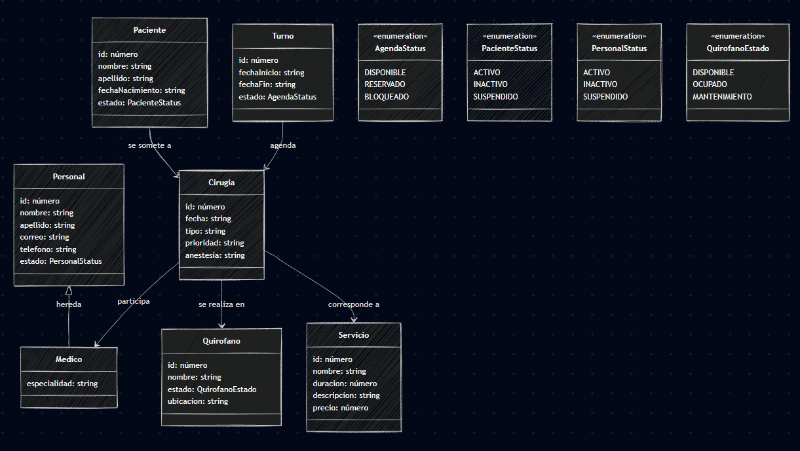

## Microservicio de Servicios Hospitalarios

Este módulo es un microservicio desarrollado con NestJS que utiliza comunicación TCP para la gestión de los servicios hospitalarios relacionados con el área de quirófanos.


### Tabla de Contenidos
- [Estado](#Estado)
- [Descripción](#descripción)
- [Tech Stack del proyecto](#tech-stack-del-proyecto)
- [Estructura del Proyecto](#estructura-del-proyecto)
- [Instalación](#instalación)
- [Ejecución](#ejecución)
- [Mensajes TCP Principales](#mensajes-tcp-principales)
- [Ejemplo de uso TCP](#ejemplo-de-uso-tcp)
- [Configuración](#configuración)


---

# Documentación 

## Estado
Proyecto en **fase de desarrollo** - Funcionalidades core implementadas. Mejoras y optimizaciones en progreso.

## Descripción
Este microservicio administra y expone operaciones para la gestión de los distintos servicios hospitalarios mediante comunicación TCP, permitiendo su integración con otros módulos del sistema y facilitando el acceso seguro a la información de servicios.

## Diagrama de clases simplificado


## Tech Stack del proyecto
- Framework: NestJS v11 (Microservicio TCP con TypeScript)
- Comunicación: @nestjs/microservices (protocolo TCP)
- Bases de datos: PostgreSQL
- Prisma: ORM y toolkit para acceso y gestión de datos en bases de datos relacionales
- Validación: class-validator + class-transformer
- Configuración: dotenv + @nestjs/config
- Validación de esquemas: Joi
- Async: RxJS (Observables)
- Docker: Para levantar Keycloak localmente (ver docker-compose.yml) y bases de datos de los microservicios (ver en sus respectivos repositorios)
- Algunos patrones utilizados: 
  - Client Pattern: Clientes dedicados para cada microservicio
  - DTO Pattern: Para validación de datos en entrada/salida
  - Singleton Pattern: Los servicios inyectados son singletons por defecto en NestJS
  - Exception Handling Pattern: Usa RpcException para capturar y lanzar errores de microservicios


## Estructura del Proyecto

```
src/
  common/         # Utilidades y excepciones comunes
  config/         # Configuración de entornos y servicios
  servicios/      # Gestión de servicios hospitalarios
```

## Instalación

1. Clonar el repositorio:
   ```bash
   git clone <repo-url>
   cd servicios-ms
   ```
2. Instalar las dependencias:
   ```bash
   npm install
   ```

## Ejecución

### Local
```bash
npm run start:dev
```

### Docker
1. Tener Docker instalado.
2. Navegar a la raiz y ejecutar:
   ```bash
   docker-compose up --build
   ```
   Esto levanta el servidor de la Base de datos
   - Credenciales: admin@gmail.com / admin


## Mensajes TCP principales
Este microservicio responde a mensajes TCP con los siguientes patrones principales:

- `findAllServices`: Obtiene la lista de servicios hospitalarios
- `findServiceById`: Obtiene un servicio por su ID
- `createService`: Crea un nuevo servicio hospitalario
- `updateService`: Actualiza un servicio existente
- `deleteService`: Elimina un servicio

Consulta el código fuente para ver los payloads y DTOs utilizados en cada patrón.

## Configuración
Variables de entorno principales (ver `src/config/envs.ts`):

- `PORT`: Puerto del microservicio TCP
- `DATABASE_URL`: Cadena de conexión a la base de datos PostgreSQL utilizada por Prisma.
- `NODE_ENV`: Entorno de ejecución de la aplicación


